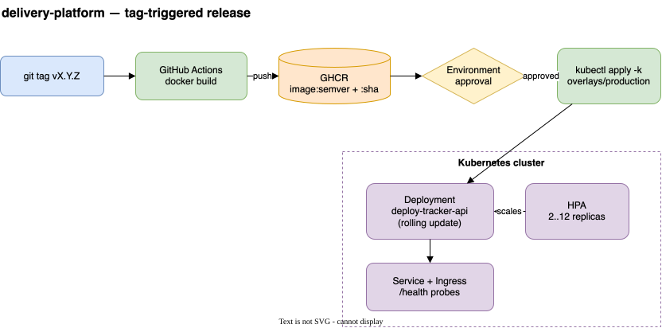

# delivery-platform

How the [`deploy-tracker`](../deploy-tracker) service ships to Kubernetes. Two
packaging paths (pick one per cluster convention) plus a tag-triggered release
pipeline:

- **Helm chart** (`charts/deploy-tracker`) — parameterised, with an HPA, probes,
  ingress, and a production values overlay.
- **Kustomize** (`manifests/`) — a plain base with `staging` / `production`
  overlays for teams that prefer overlays to templating.

## Release flow



> Rendered from [`docs/architecture.drawio`](docs/architecture.drawio) — open the source in [diagrams.net](https://app.diagrams.net) to edit.

## Helm

```bash
# render
helm template charts/deploy-tracker -f charts/deploy-tracker/values-production.yaml

# install / upgrade
helm upgrade --install deploy-tracker charts/deploy-tracker \
  -n deploy-tracker-production --create-namespace \
  -f charts/deploy-tracker/values-production.yaml \
  --set image.tag=v0.1.0
```

Chart features: templated image tag defaulting to `appVersion`, readiness +
liveness probes on `/health`, optional HPA (`autoscaling.enabled`), optional
ingress with cert-manager annotations, and non-secret config via `env` with
secrets pulled from an existing `Secret` via `envFromSecret`.

## Kustomize

```bash
kubectl apply -k manifests/overlays/staging
kubectl apply -k manifests/overlays/production
```

| Overlay    | Namespace                    | Replicas | Image tag |
|------------|------------------------------|----------|-----------|
| staging    | `deploy-tracker-staging`     | 1        | `staging` |
| production | `deploy-tracker-production`  | 3        | `v0.1.0`  |

## CI

- [`validate.yml`](.github/workflows/validate.yml) — `helm lint` + `helm template`
  on both value sets, and `kubectl kustomize` on both overlays, on every PR.
- [`release.yml`](.github/workflows/release.yml) — a **reusable** (`workflow_call`)
  pipeline: build, push to GHCR with semver + sha tags, then a gated deploy
  (GitHub Environment approval) that applies the production overlay and waits for
  the rollout. Application repos call it with a few inputs instead of copying the
  logic — see [`examples/app-caller.yml`](examples/app-caller.yml).

Both overlays are verified locally with `kubectl kustomize`.

## Architecture decisions

Why ship both Helm and Kustomize, and why the release pipeline is a single
reusable workflow instead of copies — recorded with the trade-offs in
[`docs/adr/`](docs/adr/).

## License

MIT
